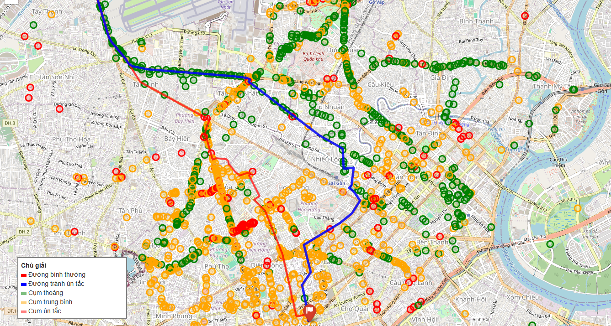

# 🚦 Hệ thống Tìm Đường Tránh Ùn Tắc Dựa Trên Phân Cụm Mật Độ & Thuật Toán A*

---

## 📘 Giới thiệu

Dự án xây dựng hệ thống tìm đường thông minh có khả năng **tránh các khu vực ùn tắc giao thông** bằng cách kết hợp:

- Các thuật toán **phân cụm mật độ** (DBSCAN, OPTICS, HDBSCAN)
- Thuật toán **A*** được mở rộng theo **chi phí ùn tắc (LOS-weighted cost)**
- **Streamlit + Folium** để trực quan hóa bản đồ, cụm giao thông và đường đi tối ưu

Hệ thống phù hợp cho các bài toán điều hướng giao thông trong môi trường đô thị có mật độ biến động phức tạp.

---

## 🚀 Tính năng

### ⭐ Phân tích & xử lý dữ liệu giao thông
- Làm sạch dữ liệu BKTraffic  
- Chuẩn hóa LOS, tốc độ, vị trí  
- Tính trọng số ùn tắc & tâm segment  

### ⭐ Phân cụm mật độ (Clustering)
- DBSCAN  
- OPTICS  
- HDBSCAN (mô hình hiệu quả nhất)  
- Đánh giá bằng Silhouette Score, số cụm, tỷ lệ nhiễu  

### ⭐ Thuật toán tìm đường A* (Pathfinding)
- A* truyền thống  
- A* mở rộng LOS-weighted cost  
- Tìm đường tối ưu tránh cụm ùn tắc  

### ⭐ Minh họa trực quan
- Bản đồ phân cụm mật độ  
- Tuyến đường bình thường (shortest path)  
- Tuyến đường tránh ùn tắc (LOS-weighted A*)  
- Giao diện Streamlit  

---

🧩 Kiến trúc

  

---

🖼️ Giao diện

  

---

📊 Kết quả

HDBSCAN phân cụm ổn định hơn so với DBSCAN & OPTICS

A* mở rộng cho đường đi hợp lý hơn, tránh các đoạn LOS E–F

Tuyến đường tránh ùn tắc thường dài hơn một chút nhưng thời gian di chuyển giảm

Trực quan hóa giúp dễ đánh giá mức độ phù hợp

